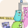

#  NoVerify plugin for PhpStorm

[](https://github.com/Danil42Russia/phpstorm-noverify-plugin/workflows/Build/badge.svg)
[](/LICENSE)
[](https://plugins.jetbrains.com/plugin/19008-noverify)
[](https://plugins.jetbrains.com/plugin/19008-noverify)

## About

This plugin adds viewing reports from [NoVerify](https://github.com/VKCOM/noverify)
to [PhpStorm](https://www.jetbrains.com/phpstorm/)

## Installation

- Using IDE built-in plugin system:

  <kbd>Settings/Preferences</kbd> > <kbd>Plugins</kbd> > <kbd>Marketplace</kbd> > <kbd>Search for "NoVerify"</kbd> >
  <kbd>Install Plugin</kbd>

- Manually:

  Download the [latest release](https://github.com/Danil42Russia/phpstorm-noverify-plugin/releases/latest) and install
  it manually using
  <kbd>Settings/Preferences</kbd> > <kbd>Plugins</kbd> > <kbd>⚙️</kbd> > <kbd>Install plugin from disk...</kbd>

## Using

- Using Composer package (Recommended)

  Install NoVerify package
  ```shell
  composer require --dev vkcom/noverify
  ```

  Download the NoVerify binary
  ```shell
  ./vendor/bin/noverify-get
  ```


- Manually:

  Download NoVerify binaries from GitHub [latest release](https://github.com/VKCOM/noverify/releases/latest) and save it
  locally

  Inside the IDE and set its path to <kbd>Settings/Preferences</kbd> > <kbd>PHP</kbd> > <kbd>Quality Tools</kbd> > <kbd>
  NoVerify</kbd> > <kbd>Configuration</kbd> > <kbd>NoVerify Path</kbd>

## License

This project is under the **MIT License**. See
the [LICENSE](https://github.com/Danil42Russia/phpstorm-noverify-plugin/blob/master/LICENSE) file
for the full license text.